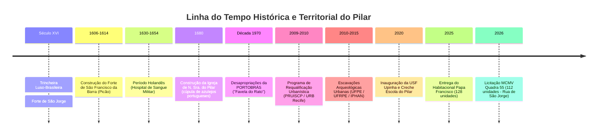
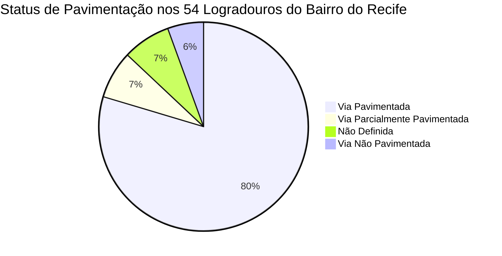
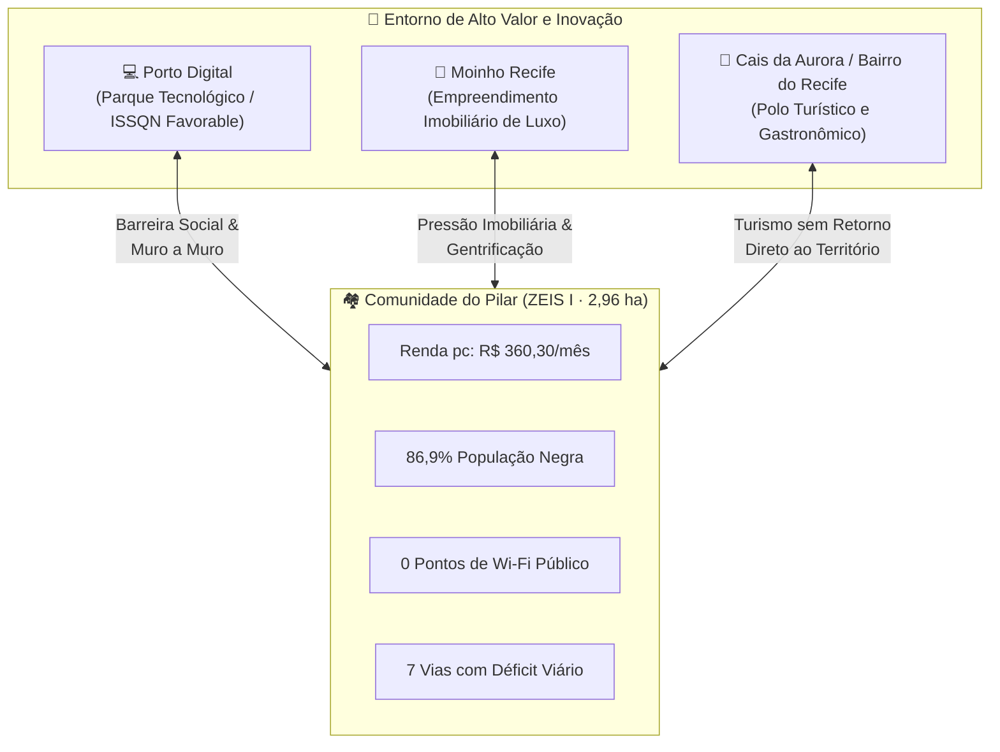

# 🏙️ Diagnóstico Territorial & Relatório de Ciência de Dados: Comunidade do Pilar
## Base de Evidências para Criação de Pilotos de Inclusão (Desafio 09 — Summer Job 2026)
### Conjunto Habitacional do Pilar | Bairro do Recife | RPA 1 | ZEIS Tipo I

> **Fontes Consultadas**: Base Aberta *Fontes Summerjob* (Prefeitura da Cidade do Recife), CadÚnico 2023 (USF Nossa Sra. do Pilar), IPHAN, UFPE, URB Recife, SECTI.  
> **Objetivo**: Subsidiar a concepção de pilotos de inclusão social, digital e urbana fundamentados em evidências empíricas da comunidade.

---

## 📜 1. Contexto Histórico e Formação Territorial

A **Comunidade do Pilar**, no extremo norte do Bairro do Recife, possui uma história de mais de quatro séculos de ocupação, resistência e transformações urbanas.



### 1.1. Espaço "Fora de Portas" e Patrimônio Tombado
* **Origem**: Historicamente situada além dos limites fortificados do Recife colonial.
* **Igreja de N. Sra. do Pilar (1680)**: Construída sobre as ruínas do Forte de São Jorge. Tombada pelo IPHAN em 1965, possui cúpula revestida por azulejos portugueses do século XVII.
* **Resistência Comunitária**: Após a demolição de 6 quadras operárias pela PORTOBRÁS nos anos 1970 para expansão portuária não concretizada, a reocupação popular manteve a identidade da **Comunidade do Pilar**.

### 1.2. O Sítio Arqueológico do Pilar
Escavações iniciadas em 2010 para obras habitacionais revelaram um dos acervos arqueológicos urbanos mais expressivos do país:
* **>150.000 artefatos**: Cachimbos holandeses de caolim (*goudsche pijpen*), tijolos de Haia, faianças de Delft, moedas da WIC e projéteis.
* **Bioarqueologia**: Exumação de 100 a 130 ossadas humanas (UFPE/IPHAN) com patologias e marcadores de trabalho braçal intenso associados à escravidão e estiva.

---

## 📊 2. Diagnóstico Socioeconômico Empírico (CadÚnico USF Pilar 2023)

Com base no cruzamento de dados dos microdados de atendimento da **US 278 — USF Nossa Senhora do Pilar** (`cadastro-unico-2023.csv`):

| Indicador Socioeconômico | Valor Apurado | Leitura Crítica para Formulação de Pilotos |
|:---|:---:|:---|
| **Atendimentos Cadastrados** | **145 indivíduos/famílias** | Base primária da unidade de saúde comunitária |
| **População Étnico-Racial Negra** | **86,9%** | **68,3% Pardos (99) + 18,6% Pretos (27)**; centralidade da raça no direito à cidade |
| **População Branca / Amarela** | **13,1%** | 11,7% Branca (17) + 1,4% Amarela (2) |
| **Renda Per Capita Mensal Média** | **R$ 360,30** | Extrema vulnerabilidade econômica (profundamente abaixo da linha de pobreza) |
| **Renda Familiar Total Média** | **R$ 734,19** | Orçamento médio familiar (~3 pessoas por domicílio) |
| **Dependência de Transferência de Renda** | **69,0%** | **100 famílias dependentes do Bolsa Família** |
| **Gasto Médio com Alimentação** | **R$ 316,93** | Consome **43,1% de toda a renda familiar média** |

> [!CAUTION]
> **Vulnerabilidade Financeira Severa:** Com 43,1% da renda familiar comprometida exclusivamente com alimentação básica e renda *per capita* de R$ 360,30, **qualquer piloto que exija custos diretos do usuário (como planos de dados móveis) terá taxa zero de adesão**. Soluções precisam ser de custo zero para o morador.

---

## 🏗️ 3. Balanço de Moradia e Infraestrutura Urbana

### 3.1. Evolução das Unidades Habitacionais

| Etapa / Empreendimento | Ano | Unidades | Situação Atual |
|:---|:---:|:---:|:---|
| Meta Global (PRUISCP) | 2009 | 588 habitações | Planejamento original |
| Quadra 40 (Bloco C) | 2012 | 48 habitações | Entregue |
| Quadras 30 e 40 (Demais blocos) | 2012–2015 | 144 habitações | Entregue |
| Habitacional Papa Francisco (Quadra 50) | 2025 | 128 habitações | Entregue |
| Quadra 55 (Rua de São Jorge) | 2026 | 112 habitações | Em fase de licitação/obras (MCMV FAR) |
| **Total Concluído** | **2025** | **~320 habitações** | **Déficit remanescente em processo de atendimento** |

### 3.2. Indicadores Físico-Territoriais (Base Fontes Summerjob)



* **Área da ZEIS Pilar**: **2,9637 ha** (Perímetro: 749,58 m). Representa apenas **9,6% da área média** das 92 ZEIS do Recife (30,8 ha).
* **Pontos de Wi-Fi Público (Conecta Recife)**: **0 pontos** registrados dentro da poligonal da ZEIS Pilar (dos 472 pontos municipais).
* **Infraestrutura Viária**: 3 vias não pavimentadas e 4 parcialmente pavimentadas no Bairro do Recife, afetando o acesso interno ao conjunto.
* **Equipamentos Públicos no Entorno**: 11 praças e áreas verdes cadastrais (Forte do Brum, Cais do Apolo, Praça Tiradentes, Marco Zero).

---

## 🏙️ 4. Matriz de Contradições e Gentrificação



---

## 🚨 5. Diagnóstico de Lacunas para Inclusão (Gaps Reais)

A partir da análise cruzada dos dados, identificamos **4 grandes eixos de vulnerabilidade e exclusão** na Comunidade do Pilar:

### Eixo A: Exclusão Digital e Desconectividade
1. **Apagão de Wi-Fi Público**: 0 dos 472 pontos do Conecta Recife estão localizados no Pilar.
2. **Incapacidade de Custeio de Dados**: Com R$ 360,30 de renda *per capita*, moradores não possuem margem para pacotes privados de internet móvel.
3. **Barreira de Letramento Digital**: Concentração de idosos e população vulnerável sem letramento tecnológico para serviços públicos digitais.

### Eixo B: Barreiras de Acessibilidade Urbana e Física
1. **Infraestrutura Interna Incompleta**: Trechos e acessos sem pavimentação e iluminação adequada no entorno dos habitacionais.
2. **Dificuldade para PcDs e Idosos**: Falta de rotas acessíveis conectando o Conjunto Habitacional do Pilar aos equipamentos públicos do bairro (Upinha, Creche, Forte do Brum).

### Eixo C: Desconexão Socioeconômica com o Porto Digital (Efeito "Muro a Muro")
1. **Falta de Inclusão Produtiva**: A proximidade física (<300m) com o maior polo de inovação do Nordeste não se traduz em empregabilidade local ou capacitação tecnológica efetiva para os jovens do Pilar.
2. **Economia Informal Estagnada**: Moradores dependem de trabalhos informais sem integração com a economia criativa e turística do Recife Antigo.

### Eixo D: Apagamento Histórico e Memória Comunitária
1. **Falta de Acesso ao Próprio Patrimônio**: Mais de 150.000 achados arqueológicos do Pilar estão salvaguardados em laboratórios (UFPE/IPHAN), sem um centro de memória ou sinalização interpretativa no próprio território.

---

## 💡 6. Matriz de Oportunidades para Formulação de Pilotos (Desafio 09)

Esta matriz orienta a concepção de **pilotos inéditos** direcionados a resolver os problemas identificados no Pilar:

```mermaid
quadrantChart
    title Matriz de Relevância vs. Viabilidade para Pilotos na ZEIS Pilar
    x-axis Baixa Viabilidade Técinica --> Alta Viabilidade Técnica
    y-axis Baixo Impacto Social --> Alto Impacto Social
    quadrant-1 Foco Prioritário (Quick Wins & Alto Impacto)
    quadrant-2 Projetos Estruturantes
    quadrant-3 Baixa Prioridade
    quadrant-4 Soluções Táticas de Custo Baixo
    "Ponto Wi-Fi Comunitário / Mesh": [0.85, 0.90]
    "Capacitação Tech com Porto Digital": [0.75, 0.85]
    "Rota de Acessibilidade e Pavimentação Tática": [0.80, 0.75]
    "Memorial Digital Arqueológico / QR Code": [0.90, 0.70]
    "Totem de Autocuidado / Saúde Comunitária": [0.65, 0.60]
    "Sistema de Monitoramento Físico de Obras": [0.40, 0.50]
```

### Diretrizes Orientadoras para os Novos Pilotos

1. **Premissa de Custo Zero ao Usuário Final**: Qualquer piloto digital deve prover conectividade própria (ex: rede Wi-Fi local/mesh, QR Codes offline ou Totens comunitários).
2. **Foco na População Negra e Periferia Central**: O design das soluções deve considerar que 86,9% da população é negra e que 69% vive sob transferência de renda.
3. **Conexão Direta com o Porto Digital**: Pilotos de inclusão digital/social devem buscar pontes de integração com as empresas e projetos sociais do Porto Digital.
4. **Respeito e Valorização da Memória Arqueológica**: Integrar a narrativa histórica do Forte de São Jorge e da Igreja do Pilar nas intervenções urbanas e digitais.
